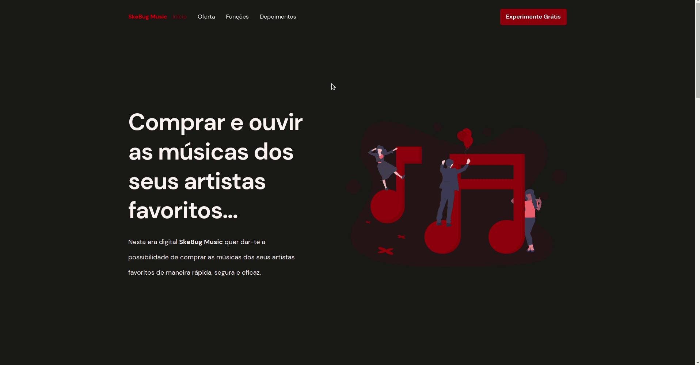

<p align="center">
  

  

  <a href="https://github.com/tgmarinho/README-ecoleta/commits/master">
    
  </a>
    
   

   
</p>
<h1 align="center" style="font-weight: bold"> 🎵 SkeBug Music - Landing Page 🎵</h1>
<h1 align="center">
    
</h1>

<h4 align="center"> 
	🚧 Em construção 🚧
</h4>

<h3 align="center"> <a href="https://skebugmusic-landingpage.vercel.app/">Acessar a demonstração</a> </h3>

---
## Índice:
<!--ts-->
   * [Sobre](#-sobre-o-projeto)
   * [Tecnologias](#-tecnologias)
   * [Como executar o projeto](#-como-executar-o-projeto)
      * [Pré-requisitos](#-pré-requisitos)
      * [Rodando o projecto](#-rodando-o-projeto)
   * [Autor](#-autor)
   * [Licença](#-licença)
   * [Versões do ReadMe](#-versões-do-readme)
        * [Português](./README-pt.md)
        * [Inglês](./README.md)
<!--/ts-->
<!--te-->
---
## 💻 Sobre o projeto

<p>
    🎵 <strong>SkeBug Music - Landing Page</strong> é um projecto desenvolvido para estudo, aplicado em uma necessidade real que é a contrução de uma landing page para captação de leeds usando estratrégias de <strong>Email-Marketing</strong> por meio de uma Newsletter e para apresentação de um projecto em desenvolimento que é o <strong>SkeBug Music App</strong> - Uma plataforma de streaming musical e venda de músicas que procura dar maior visibilidade aos <strong> artistas do musical angolano</strong> e a melhor exeperência de usabilidade aos seus ouvintes.
</p>

---
## 🛠 Tecnologias
<p>As seguintes ferramentas foram usadas na construção do projecto:</p>
<strong>Linguagem</strong>
<ul>
    <li>
        <a href="https://www.w3schools.com/js/">JavaScript</a> 
    </li>
</ul>

<strong>Runtime</strong>
<ul>
    <li><a href="https://nodejs.org/en/">Node.js</a></li>
</ul>

<strong>Library</strong>
<ul>
    <li><a href="https://reactjs.org/">ReactJS</a></li>
</ul>

<strong>Framework</strong>
<ul>
    <li><a href="https://nextjs.org/">NextJS</a></li>
</ul>

<strong>Ferramenta de Email Marketing</strong>
<ul>
    <li><a href="https://mailchimp.com/">Mailchimp</a></li>
</ul>

<strong>Deploy</strong>
<ul>
    <li><a href="https://vercel.com/">Vercel</a></li>
</ul>

---
## 🚀 Como executar o projeto
---
### ✅ Pré-requisitos:

<li><a href="https://git-scm.com">Git</a></li>
<li><a href="https://nodejs.org/en/">Node.js</a></li>
<p>Além disto é bom ter um editor para trabalhar com o código como o <a href="https://code.visualstudio.com/">Visual Studio Code (VSCode)</a> </p>

---
### 🎲 Rodando o projecto

```bash
# 1 - Clone este repositório
$ git clone https://github.com/EvandroSilvaProgrammer/SkeBug_Music-LandingPage.git

# 2 - Acesse a pasta do projeto no terminal/cmd
$ cd SkeBug_Music-LandingPage

# Instale as dependências
$ yarn
#ou
$ npm install

# Execute a aplicação em modo de desenvolvimento
$ yarn dev
#ou
$ npm run dev

# O projecto inciará na porta:3000 - acesse http://localhost:3000

```

---

## 🦸 Autor

<a href="https://github.com/EvandroSilvaProgrammer">
 
 <br />
 <sub><b>Evandro Silva AKA SkeBug</b></sub></a> <a href="https://github.com/EvandroSilvaProgrammer" title="EvandroSilva">🇦🇴</a>
 <br /> <br />

[](https://www.linkedin.com/in/evandrosilva-programmer/) 

[](https://www.facebook.com/evandrosilva.programmer)

[](mailto:evandrosilva.programmer@gmail.com)

---

## 📝 Licença

Este projeto esta sobe a licença [MIT](./LICENSE).

Feito com ❤️ por Evandro Silva AKA SkeBug 👋🏽 [Entre em contato!](https://www.linkedin.com/in/evandrosilva-programmer/)

---

##  Versões do README

[Português 🇦🇴](./README.md)  |  [Inglês 🇺🇸](./README-en.md) 
